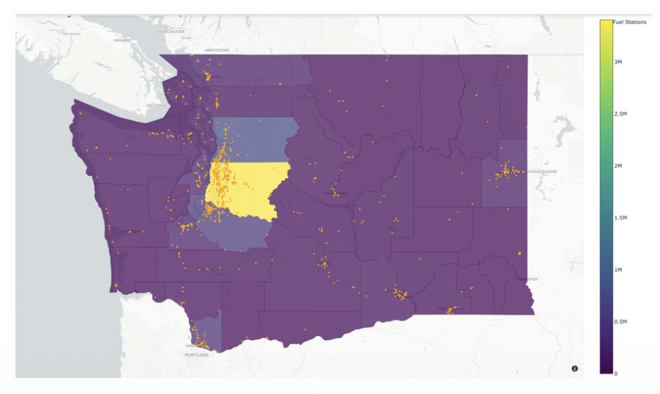
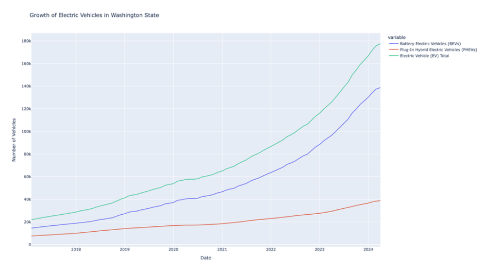
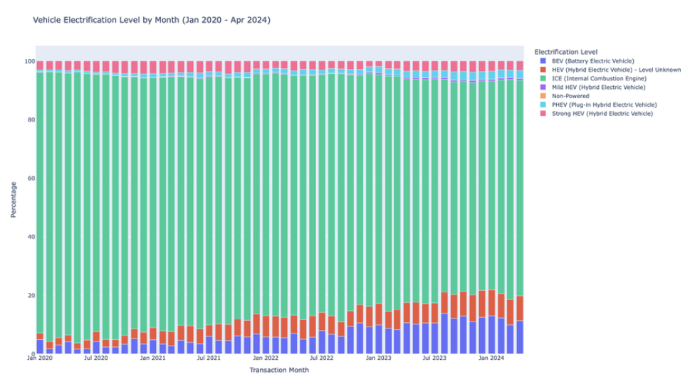
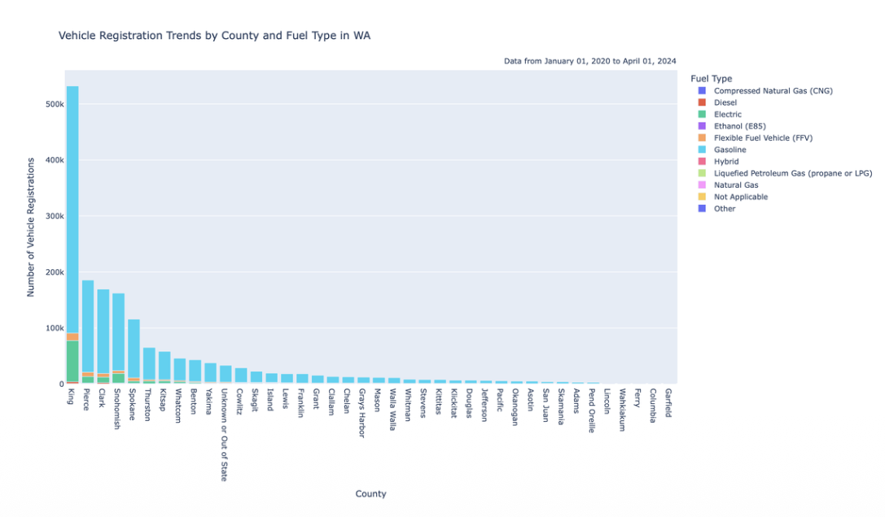
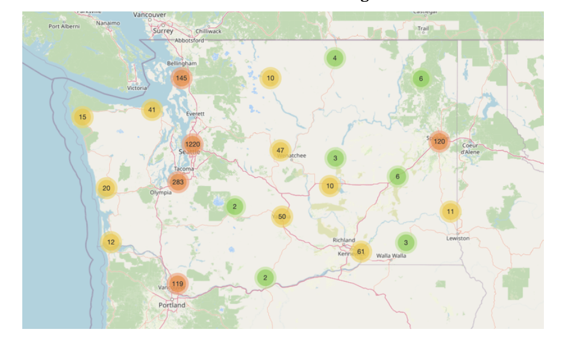
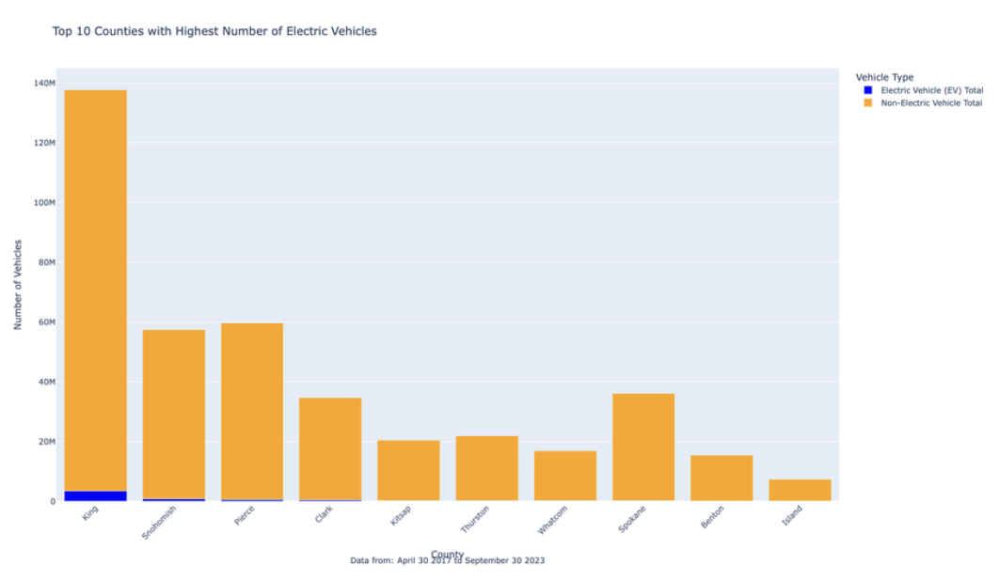
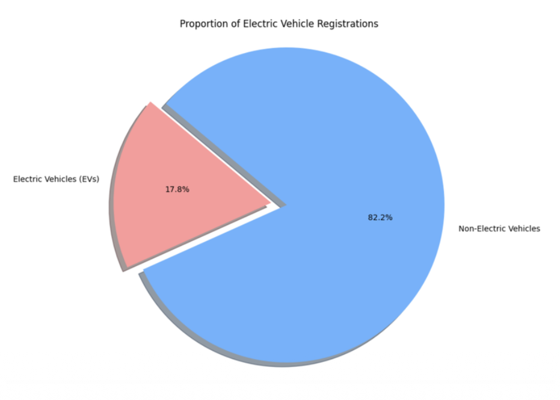

# Understanding Electric Vehicle Uptake in Washington State

Analyzing the adoption of electric vehicles across Washington state, focusing on charging station distribution, registration trends, and regional disparities in infrastructure. This project uses 5 merged datasets covering EV registrations, charging station locations, vehicle population by county, and population density.

## Research Questions

1. Where are EV charging stations located in Washington state, and how does their distribution correlate with population density?
2. What are the trends in EV registrations over time?
3. How do EV registration numbers vary across counties?
4. Are there disparities in charging station availability across different regions?

## Key Findings

- Charging stations are concentrated in urban counties with higher population densities, confirming a positive correlation between infrastructure and population
- EV registrations grew nearly 7x between 2017 and 2024, from under 25,000 to over 175,000 total vehicles
- King County leads EV adoption by a wide margin, followed by Snohomish and Pierce counties
- ICE vehicle registrations have been steadily declining while BEV registrations have grown consistently year over year
- Rural and lower-density counties show significantly lower adoption rates, pointing to infrastructure gaps
- 17.8% of all registered vehicles in Washington state are electric

## Visualizations

### 1. Population Density and Fuel Station Distribution
Choropleth map showing total EVs per county overlaid with orange markers for fuel station locations. King County (yellow) stands out as the densest area for both EVs and charging infrastructure. Snohomish and Skagit counties also show high concentrations. Rural eastern Washington is almost entirely underserved.

---

### 2. EV Registration Trends Over Time (2017 - 2024)
Line plot tracking Battery Electric Vehicles (BEVs), Plug-In Hybrid Electric Vehicles (PHEVs), and total EVs from 2017 to 2024. Total EV registrations surged from under 25,000 to over 175,000, a nearly sevenfold increase. BEVs drove the majority of growth, accelerating sharply after 2021. PHEVs grew steadily but more slowly, reaching around 40,000 by 2024.

---

### 3. Vehicle Electrification Level by Month (Jan 2020 - Apr 2024)
Stacked bar chart showing the monthly percentage mix of vehicle types registered in Washington state. ICE vehicles (green) have declined from dominating nearly all registrations to a noticeably smaller share by 2024. BEVs (blue) and Strong HEVs (pink) have both grown steadily month over month. PHEVs have remained relatively consistent throughout.

---

### 4. Vehicle Registration Trends by County and Fuel Type (Jan 2020 - Apr 2024)
County-level breakdown of all vehicle registrations by fuel type. King County dominates with over 500,000 total registrations, including a visible green segment representing electric vehicles, the largest EV count of any county. Gasoline (blue) is still the majority fuel type across all counties. The chart makes clear how concentrated registration activity is in the Puget Sound region compared to eastern Washington.

---

### 5. Fuel Stations Across Washington (Interactive Map)
Folium map showing clustered fuel station counts across the state, color-coded by density. Seattle and surrounding areas show a cluster of 1,220 stations. Tacoma/Olympia area shows 283. Bellingham shows 145. Eastern Washington cities like Spokane (120) and the Tri-Cities area (61) have moderate coverage, while most rural areas have fewer than 10 stations. The map highlights a clear west-east infrastructure divide.

---

### 6. Top 10 Counties by EV Count (Apr 2017 - Sep 2023)
Stacked bar chart comparing total vehicle counts (EV vs non-electric) across the top 10 counties. King County is the clear leader with nearly 140M total vehicle-registrations recorded, with a visible blue EV segment. Snohomish and Pierce follow. The EV segment is small relative to total vehicles in all counties, reinforcing that EVs are still a minority even in high-adoption areas.

---

### 7. Proportion of EV Registrations
Pie chart showing that 17.8% of all registered vehicles in Washington state are electric, compared to 82.2% non-electric. While EVs remain a minority, Washington is one of the leading states nationally for EV adoption.

---

## Tools Used

Python, Pandas, Plotly, Folium

## Datasets

- [EV Share of New Registrations](https://data.wa.gov/Transportation/Electric-Vehicle-Share-of-New-Registrations/wzin-vviu) - data.wa.gov
- [EV Population Size History by County](https://data.wa.gov/Transportation/Electric-Vehicle-Population-Size-History-By-County/3d5d-sdqb) - data.wa.gov
- [Fuel Station Locations](https://afdc.energy.gov/fuels/electricity_locations.html) - afdc.energy.gov
- [US County Boundaries](https://public.opendatasoft.com/explore/dataset/us-county-boundaries/table/) - opendatasoft.com
- [County Population Estimates](https://www.census.gov/data/datasets/time-series/demo/popest/2020s-counties-total.html) - US Census Bureau

